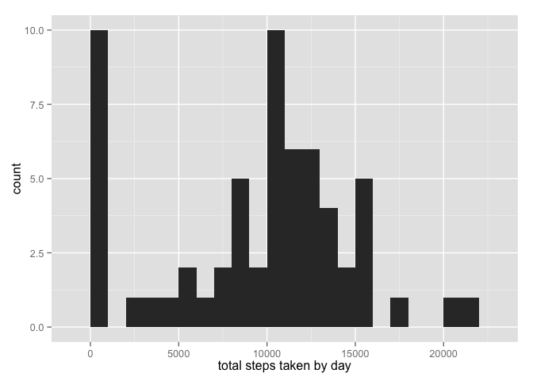

# Reproducible Research: Peer Assessment 1


## Here we will load and pre-process the data


```r
unzip(zipfile="activity.zip")
data <- read.csv("activity.csv")
```

## What is mean total number of steps taken per day?


```r
# splitting to isolate steps by day
splitSteps <- split(data$steps, data$date)
totalsplitSteps <- sapply(splitSteps, sum, na.rm=TRUE)

hist(totalsplitSteps, main="steps by day", xlab="Date (Oct to Nov 2012)", ylab="Frequency", lwd=4, col="yellow", breaks = 15)
```

 

```r
# mean steps per day

mean(totalsplitSteps, na.rm=TRUE)
```

```
## [1] 9354.23
```

```r
# median steps per day

median(totalsplitSteps, na.rm=TRUE)
```

```
## [1] 10395
```

```r
## What is the average daily activity pattern?


## Imputing missing values


## Are there differences in activity patterns between weekdays and weekends?
```
