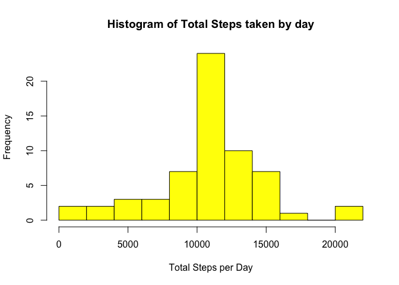

# Reproducible Research: Peer Assessment 1


## Here we will load and pre-process the data


```r
unzip(zipfile="activity.zip")
data <- read.csv("activity.csv")
```

## What is mean total number of steps taken per day?


```r
totSteps <- tapply(data$steps, data$date, FUN=sum, na.rm=TRUE)
```

a histogram showing the frequency of steps by day

```r
hist(totSteps, main="steps by day", xlab="Date (Oct to Nov 2012)", ylab="Frequency", lwd=4, col="yellow", breaks = 15)
```

 

###mean steps per day

```r
mean(totSteps, na.rm=TRUE)
```

```
## [1] 9354.23
```

###median steps per day

```r
median(totSteps, na.rm=TRUE)
```

```
## [1] 10395
```

## What is the average daily activity pattern?

A time series plot of the 5-minute interval (x-axis) and the average number of steps taken, averaged across all days (y-axis)


```r
avgsteps <- tapply(data$steps,data$interval,
                                 mean,na.rm=TRUE)
```

Timeseries plot, 5-min interval average steps, again averaged across days


```r
plot(row.names(avgsteps),avgsteps,type="l",
     xlab="5-minute time intervals", 
     ylab="Mean number of steps taken total", 
     main="Mean steps at 5 minute Intervals",
     col="RED")
```

 

Time interval that contains maximum average number of steps over all days is calculated here,


```r
interval_id <- which.max(avgsteps)
interval_max <- names(interval_id)
interval_max
```

```
## [1] "835"
```
The 835 minute or 104th, 5 minute interval contains the max number of steps on average, over all of the days observed.


## Imputing missing values

###Calculate and report the total number of missing values in the dataset.

```r
num_nas <- sum(is.na(data))
```
The number of missing values is 2304.

###Devise a strategy for filling in all of the missing values in the dataset. 

```r
na_ids <-  which(is.na(data))
imputed <- avgsteps[as.character(data[na_ids,3])]
names(imputed) <- na_ids
for (i in na_ids) {
    data$steps[i] = imputed[as.character(i)]
}

totsteps <- tapply(data$steps, data$date,sum)
hist(totsteps,col="yellow",xlab="Total Steps per Day", 
      ylab="Frequency", main="Histogram of Total Steps taken by day", breaks = 15)
```

 

Calculate and report the mean and median total number of steps taken per day.

```r
mean(totsteps)
```

```
## [1] 10766.19
```

```r
median(totsteps)
```

```
## [1] 10766.19
```
Adding the missing data has increased the mean values, this appears to be because most of the NA values occurred on days where very little to no data was collected at all. It follows that the median would now closely match the mean.

## Are there differences in activity patterns between weekdays and weekends?

Creating a new factor variable in the dataset with two levels – “weekday” and “weekend” indicating whether a given date is a weekday or weekend day.

```r
data$date <- as.Date(data$date,"%Y-%m-%d")
days <- weekdays(data$date)
data$day_type <- ifelse(days == "Saturday" | days == "Sunday", "Weekend", "Weekday")
```

Making a panel plot containing a time series plot (i.e. type = "l") of the 5-minute interval (x-axis) and the average number of steps taken, averaged across all weekday days or weekend days (y-axis).

```r
avgsteps <- aggregate(data$steps, by=list(data$interval, data$day_type),mean)
names(avgsteps) <- c("interval","day_type","steps")
library("lattice")
xyplot(steps~interval | day_type, avgsteps,type="l", layout=c(1,2),xlab="Interval",ylab = "Number of steps")
```

 

It is interesting to note the increased overall activity on weekends, but weekday mornings peak with consistent preparation for the work day.
